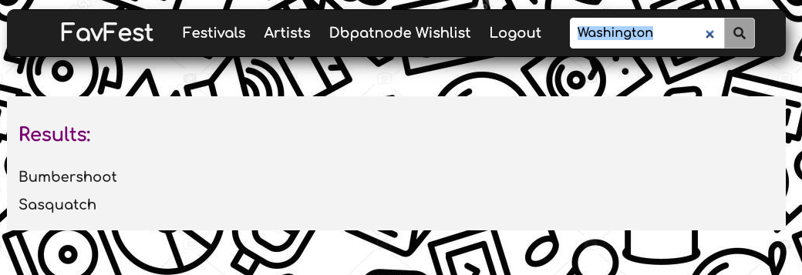
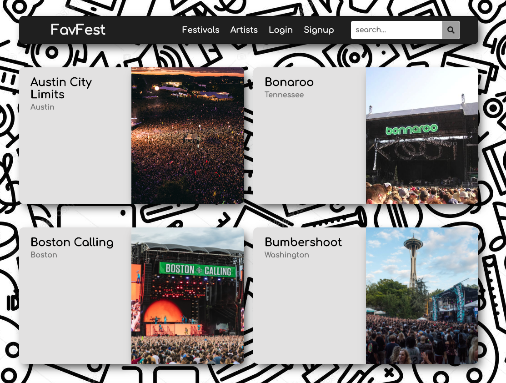
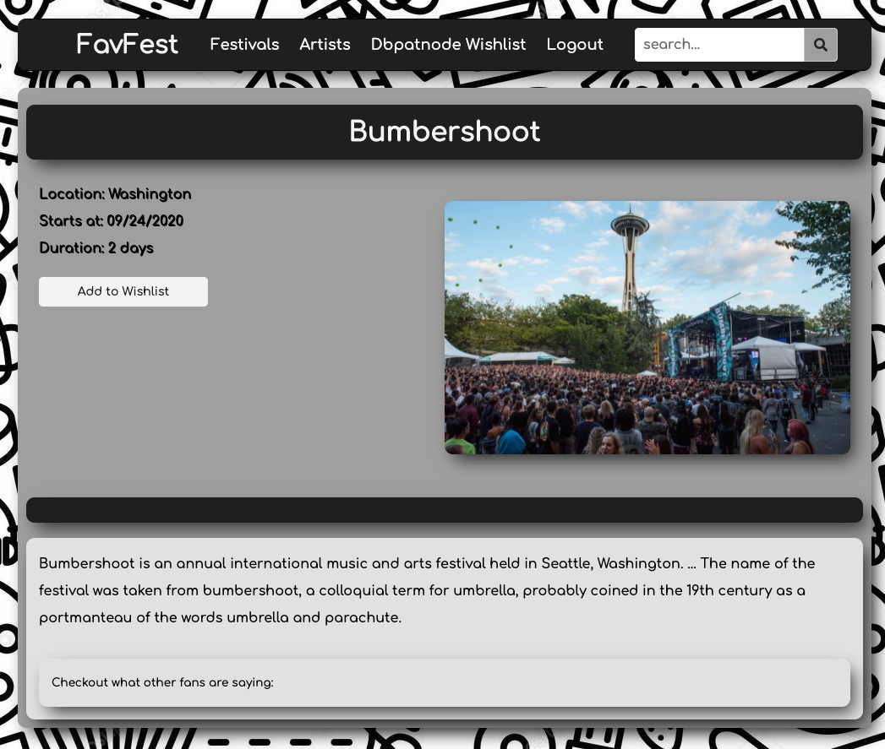
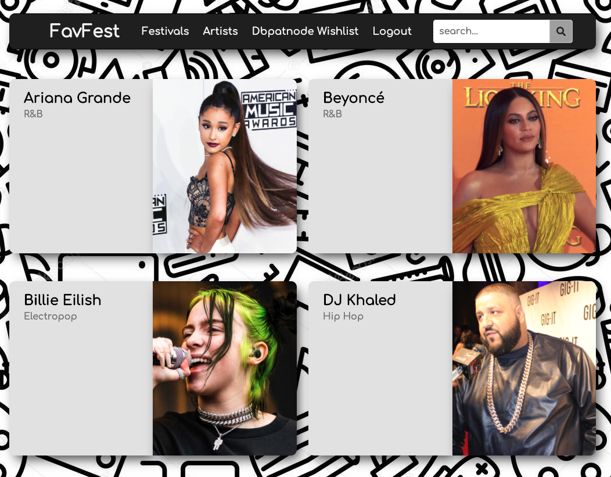
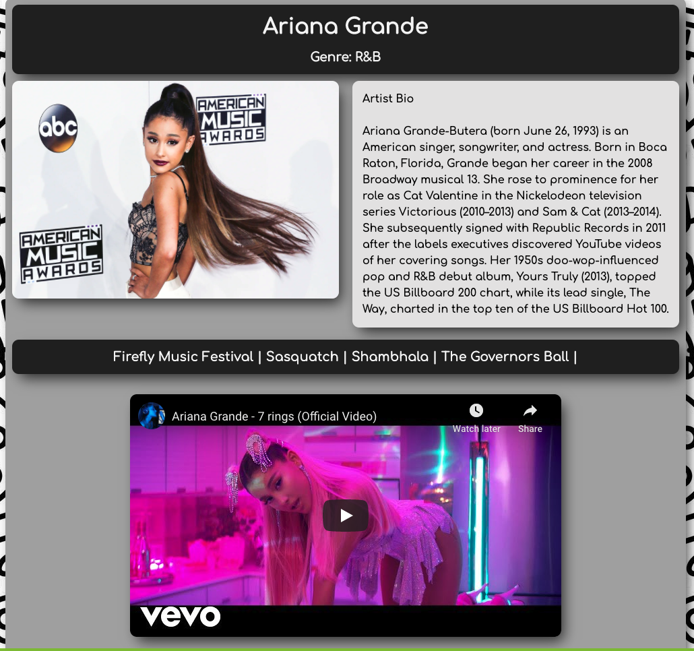
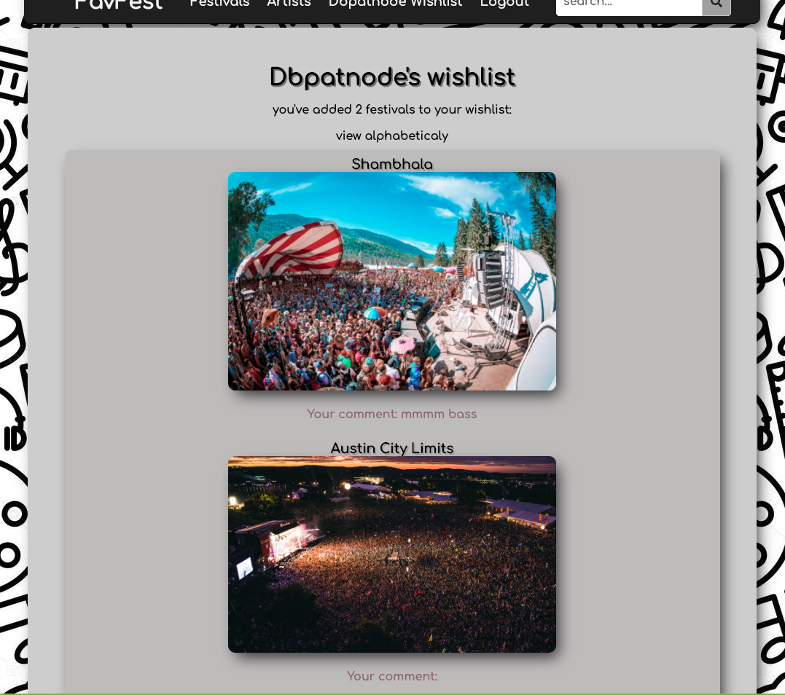

🎸🤘🎼🎵FavFest🎸🤘🎼🎵
=========================

FavFest was built with the intention of providing users more information about the festivals they love and allowing a interective diary of sorts for the festivals they enjoy.

FaveFest allows for an immersive user experience in which users can search, add festivals to their wishlish and add associated comments to those festivals added to their wishlist. in addition users can view different artists associated with given festivals and vice versa.

---
### SECURITY :

User profiles are secured through a personal username and encrypted password protection. Users are required to login before being able to add festivals and their associated comments to their wishlist. users who aren't logged in have access to view festival festival and artists profile pages without adding to their wishlist or leaving comments.

---

### SEARCH : 

Users can search within the app based on 

* artist
* artist genre
* festival name
* festival location
    

The search will yeild results for a combination of both artists and festivals.

---
### FESTIVALS :

The festival page includes links to individual festival pages with the following formation:
* name
* location
* photo
* start date
* duration
* artists playing (as links to their artist page)
* description 
* other users comments about the festival

IF LOGGED IN:
* button to add to wishlist
* comment text field and associated buttons to submit comments

---
### ARTISTS :

The artist page includes links to individual artist pages with the following formation :

* name
* genre
* photo
* artist bio
* festivals the artist is playing at (as links to the festival page)
* selected music video for that artist

---
### MY WISHLIST :

User data is accessible through the "my wishlist" option, where users can:
* view festivals they've added to their wishlist
* view comments they've added to their wishlist
* view festivals and comments added to their wishlist based on most recent
* view festivals and comments added to their wishlist in alphabetical order

